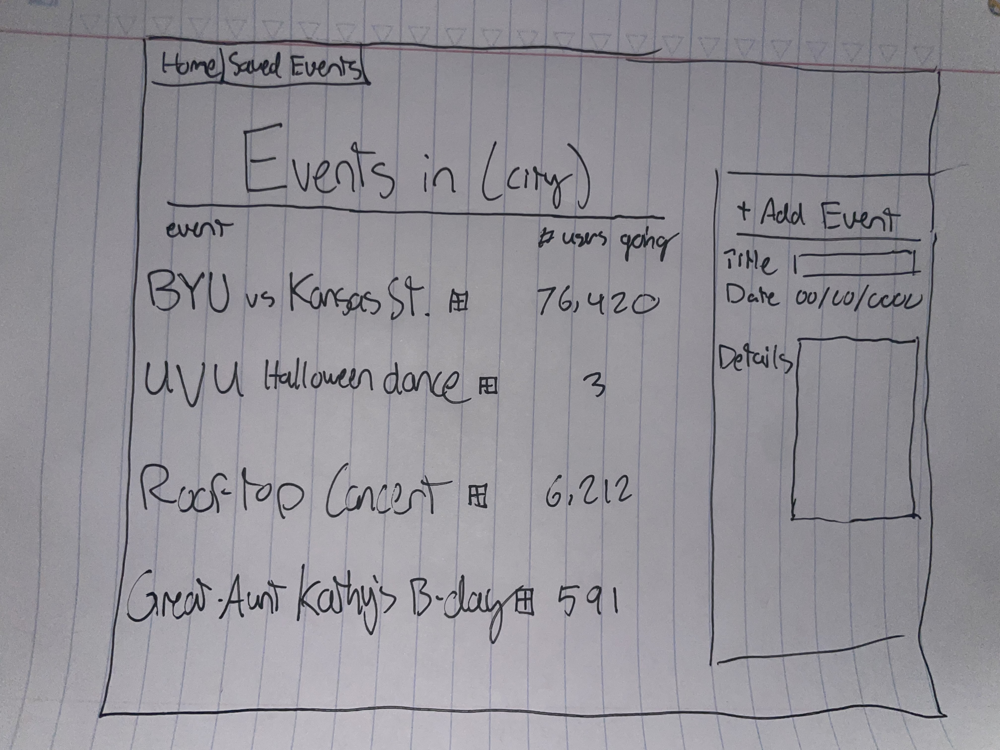

# That's What's Up

## Specification Deliverable

### Elevator Pitch
It's a Saturday night, all of your assignments are completed and you just finished a 2-hour slog in the testing center. You finally meet up with your friends, but you end up spending the last 3 hours of the night trying to decide what to do. Enter 'That's What's Up'. With this website, users can find events happening in their area. Anyone can post about an event, and users will have the opportunity to save upcoming events for later. Each event has dates, details, and the number of users planning on attending. You'll never have to waste time trying to come up with something fun to do again.
### Design

### Key Features
- Secure login over HTTPS
- Location Services to determine the user's area
- List of Popular events in the area, # of users attending, and the capability to save these events for later
- The capability to access your saved events
- The capability to add events to the public list
### Technologies
- **HTML** - Uses correct HTML structure for application. Three HTML pages, one for login, one for the public events list, and one for a user's saved events.

- **CSS** - Application styling that looks good on different screen sizes, uses good whitespace, color choice and contrast.

- **JavaScript** - Provides login, interactions with events, creates new event objects, counts user attendance.

- **React** - Reactivity to user inputs, components, routes user experience.

- **Service** - Backend service with endpoints for:
    - login
    - obtaining locations
    - accessing weather during upcoming events
    - rating events due to popularity

- **DB/Login** - Store users, public events, a user's saved events, # of users planning on attending an event. Register and login users, credentials securely stored in database.

- **WebSocket** - Realtime updates on new events, users planning to attend.

## Class Notes

[My Notes](notes.md)
